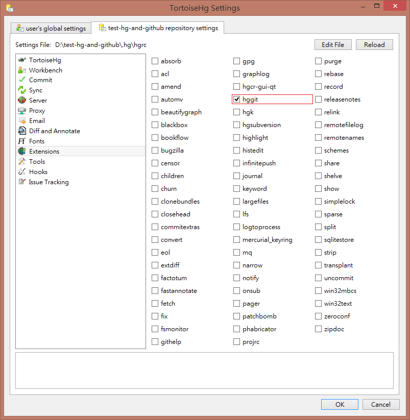

## Environment

* TortoiseHg version 5.0.2

## Reference

* [Using GitHub with Mercurial and TortoiseHG](https://www.ryadel.com/en/using-github-with-mercurial-and-tortoisehg/)
* [hg-git "abort: No module named selectors!"](https://bitbucket.org/tortoisehg/thg/issues/5140/hg-git-abort-no-module-named-selectors)

## Steps

1. Create a repo locally using TortoiseHg.

2. Create an empty repo on GitHub.

3. Enable the extention **hggit**.  

      

      

    Here I enable it on a per repo basis.

4. Copy the GitHub repo's URL. In the **Synchronize**  settings, paste the URL and prefix it with `git+`.  

    

5. Execute `outgoing` or `push` now. I see this error message: `No module named selectors!`.

    

6. Google. Found this: [hg-git "abort: No module named selectors!"](https://bitbucket.org/tortoisehg/thg/issues/5140/hg-git-abort-no-module-named-selectors).  

    > Evengard
    > 
    > For the people who are like me searching for a solution - I’ve crafted the library.zip specifically for 5.0.2 using the instructions from @vitidev . “Plug and play”. Just unpack the ZIP into your TortoiseHG folder. https://drive.google.com/open?id=1vHV8ObokiOkYSorZJZqFHEgvtcLIVSe3
    > 
    >     2019-10-19

    * Download the link above. Extract and overwrite.

      ```
      Program Files\TortoiseHg\lib\
      ├ cacert.pem
      ├ library.zip
      ├ library.zip.bak
      ```

7. `outgoing` or `push` works now. Repo pushed to GitHub successfully.